# LocalFlow + NotesFM — Architecture

Two features in one menu-bar app, sharing one event tap, one settings store and
one microphone.

- **LocalFlow** — hold a key, speak, release, text appears in whatever app has
  focus. Shipped and in daily use.
- **NotesFM** — `Fn+R` records a meeting and transcribes **both sides** live into
  a markdown file; `Fn+P` pauses it. Built and unit-tested, not yet proven
  against a real call.

No account, no subscription, no network traffic except optionally to
`localhost:11434`.

This document explains **how the thing is built and why it is built that way**.
For decisions, dead ends and maintenance gotchas, see [`../NOTES.md`](../NOTES.md).

| | Part I — dictation | Part II — meetings | Part III — shared |
|---|---|---|---|
| Sections | 1–9 | 10–14 | 15–18 |
| Lives in | `Sources/LocalFlow/` | `Sources/LocalFlow/NotesFM/` | both |

---

# Part I — LocalFlow (dictation)

## 1. The shape of the problem

Dictation looks simple and is not. Four independent hard parts have to line up:

| Part | Why it is hard on macOS |
|---|---|
| **Hearing the hotkey** | Fn is not a key. It never emits `keyDown` — only a `flagsChanged` modifier event. Reading global keys at all needs a `CGEventTap`, which macOS silently disables if your callback is slow. |
| **Getting audio fast** | Starting `AVAudioEngine` per keypress costs time and clips the first syllable. Keeping it running forever holds the microphone open and makes the orange privacy indicator meaningless. |
| **Transcribing locally** | Must be fast enough to feel instant, accurate in two languages, and small enough not to eat a gigabyte of RAM. |
| **Typing into another app** | There is no supported "insert text into the frontmost app" API. Every available route is a workaround with different failure modes per app. |

Everything below is a consequence of one of those four.

---

## 2. Component map

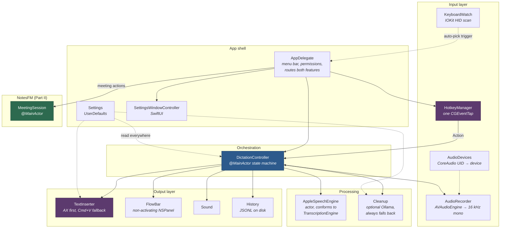

The two purple boxes are where all the platform pain lives. `DictationController`
in the middle knows nothing about `CGEventTap` or `AXUIElement` — it just receives
semantic actions and produces text.

`MeetingSession` hangs off `AppDelegate`, not off `DictationController`.
Meetings are a **separate mode**, not a variation of dictation: they capture two
streams, run for hours, and write to a file instead of typing. Teaching the
dictation state machine about them would have coupled the shipped feature to the
unproven one. `DictationController.handle` therefore receives `.toggleMeeting`
and `.togglePause` and deliberately does nothing with them.

---

## 3. The main flow — hold, speak, release, text

**This is the diagram that matters.** Real measured timings from the log are
annotated on the right.

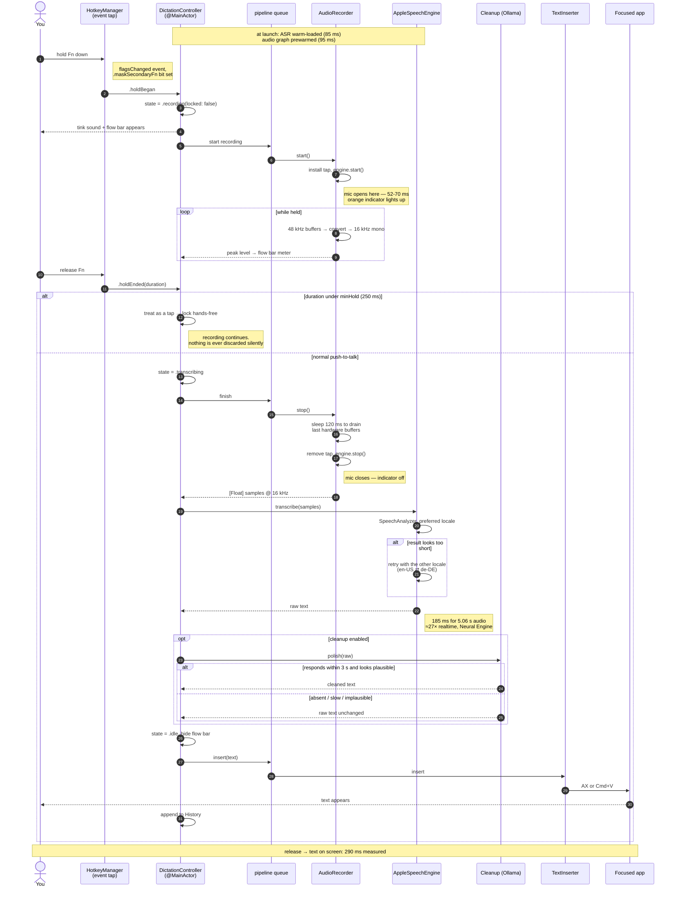

### Latency budget

| Stage | Cost | Notes |
|---|---|---|
| Fn down → mic capturing | **52–70 ms** | was 144 ms before prewarming |
| Fn up → buffers drained | 120 ms | fixed sleep, off the main thread |
| Transcription | **185–197 ms** | for 5–7 s utterances |
| Paste delay | 80 ms | configurable; Electron/terminals need it |
| **Release → text visible** | **≈290 ms** | target was under 1 s |

---

## 4. Hotkey state machine

The earlier build had a real bug here: a press shorter than the audio engine's
start time captured `0.00 s` and did nothing, silently, with no feedback. The
fix is that **every press now does something**.

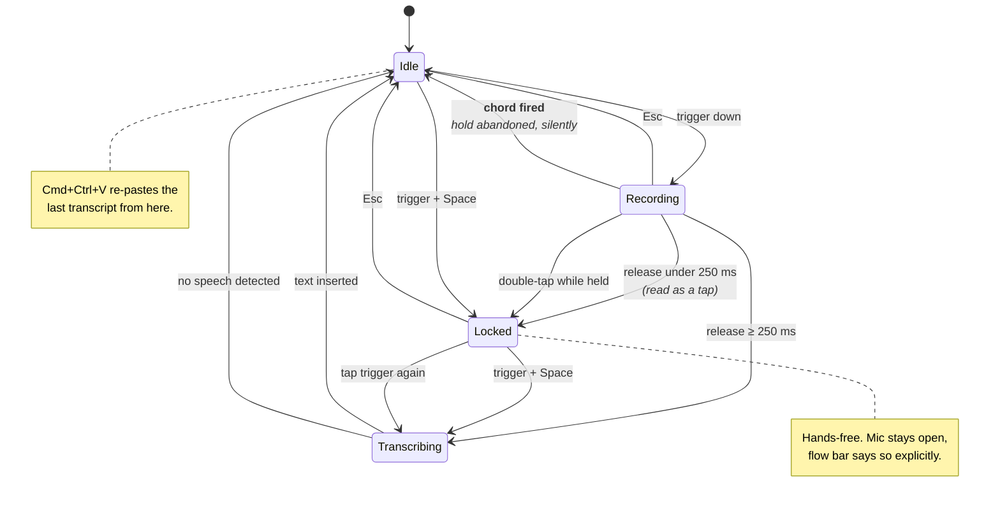

`minHold` (250 ms default) is the dividing line between "hold" and "tap", and is
adjustable in Settings → Hotkeys.

### Why chords need their own exit, and what it cost to learn

**Fn produces no `keyDown`.** It exists only as a `flagsChanged` transition, so
the moment it goes down there is no way to know whether a letter is coming. The
tap therefore emits `.holdBegan` immediately — and `DictationController` sets
`state = .recording` *synchronously*.

Every trigger chord was consequently broken:

- **`Fn+R`** started a dictation, which then failed the meeting's own
  `guard !controller.isRecordingNow` — so the hotkey answered "finish dictating
  first, then press Fn+R" and **never once started a meeting**. Releasing Fn then
  transcribed whatever it had heard and typed it into the focused app.
- **`Fn+Space`** started a dictation and then immediately *finished* it, instead
  of entering hands-free.

Two pieces fix it, and both are needed:

1. `HotkeyManager.fireChord` sets `chordFiredDuringHold`, and the release
   suppresses `.holdEnded` entirely. The hold belonged to the chord, not to
   dictation.
2. `AppDelegate` calls `controller.abandonHold()` in the *same* main-actor turn
   as the chord action, so ordering is deterministic rather than a race between
   two `Task`s. It is silent — no cancel ping, no "Cancelled" flash — because
   telling somebody a dictation they never asked for has been cancelled is noise
   about our own plumbing.

The suppressed release is also what makes the meeting interlock quiet: the
"dictation is off" message is emitted on `.holdEnded`, which only arrives when Fn
was pressed and let go with **no letter in between**. Stopping a meeting with
`Fn+R` therefore says nothing, while genuinely holding Fn mid-meeting explains
itself.

### What the event tap consumes, and what it does not

Swallowing the wrong event breaks the keyboard system-wide, so the tap is
deliberately conservative:

| Event | Consumed? | Why |
|---|---|---|
| Fn / Ctrl+Opt `flagsChanged` | **No** | Fn is a real modifier for the F-key row and countless shortcuts. |
| `Space` while trigger held | Yes | Otherwise a space character leaks into your document. |
| `R` while trigger held | Yes | Start/stop a meeting. Otherwise an `r` leaks into your document. |
| `P` while trigger held | Yes | Pause/resume a meeting. Same reason. |
| `Esc` | Only while recording | Esc must keep working normally everywhere else. |
| `Cmd+Ctrl+V` | Yes | It is our shortcut. |
| Everything else | **No** | Passed straight through. |

### Two tap survival rules

1. **Re-enable after the system kills it.** macOS disables a tap whose callback
   blocks too long, delivering `.tapDisabledByTimeout` or
   `.tapDisabledByUserInput`. `HotkeyManager.handle` catches both and calls
   `CGEvent.tapEnable` again. Without this the app dies silently after a hiccup.
2. **Ignore your own keystrokes.** `TextInserter` synthesizes Cmd+V, and the tap
   would see it. Every synthesized event carries a marker in its
   `.eventSourceUserData` field, and the tap drops anything bearing it. Without
   this, pasting could re-trigger the app.

---

## 5. Text insertion — the messy part

There is no clean API. Two routes, tried in order:


Three non-obvious details, each one a bug that was designed out:

- **`AXUIElementIsAttributeSettable` is checked before writing.** Some apps
  return `.success` for a write that does nothing. Trusting the return code
  alone would silently swallow your words.
- **Physical modifiers are waited on.** A synthesized Cmd+V merges with anything
  you are still physically holding. If Fn or Ctrl+Opt is still down, Cmd+V
  becomes a completely different shortcut.
- **The paste delay exists because of Electron.** Slack, VS Code, Cursor and
  terminals read the pasteboard asynchronously and drop the paste if the
  keystroke arrives before they notice the new pasteboard generation.

Your clipboard is snapshotted per-type per-item and restored afterwards, so
dictating never costs you what you had copied.

---

## 5b. The flow bar waveform

The first version drove all 14 bars from a **single** number — the loudest sample
in the current buffer — multiplied by a fixed centre-heavy envelope. Every bar
therefore moved in lockstep: a pulsing blob, not a waveform.

The current version treats each bar as an independent moment in time.

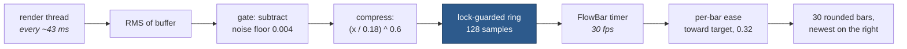

Four choices worth keeping:

- **RMS, not peak.** Peak is dominated by plosives and clicks, which pins every
  bar to full height. RMS tracks perceived loudness, so the shape on screen is
  the shape of the sentence that produced it.
- **A gate, so silence is actually still.** Below the noise floor the sample is
  zero, which is what makes the bar sit motionless when you stop talking rather
  than twitching on room noise. Quiet bars render as a row of dots at 30% alpha
  so the resting state still looks deliberate.
- **Compression.** Speech RMS lives around 0.02–0.15. A linear mapping would
  keep every bar in the bottom fifth of the bar's travel.
- **Per-bar easing toward a target.** This, not the frame rate, is what stops it
  strobing.

The ring buffer is guarded by an `NSLock` rather than the recorder's serial
queue: it is written from the audio render thread and read from the main thread,
and a single array write must never wait behind queued audio work.

### No panel, no captions

There is no background panel behind the waveform. The window is fully
transparent with `hasShadow = false`, so a red dot and a row of bars sit
directly on the desktop. An earlier build used an `NSVisualEffectView` frosted
capsule; with a dot at one end it read as a UI toggle switch rather than as
something floating.

Two consequences that had to be handled:

- **Ink is resolved per frame** from `effectiveAppearance.bestMatch(from:
  [.aqua, .darkAqua])` — black on light, white on dark. Resolving inside `draw`
  rather than caching means an appearance change is picked up on the next of the
  30 frames per second, with no observer to keep in sync.
- **A halo replaces the panel's contrast.** Without a backdrop, black ink over a
  dark terminal would vanish. Every fill is drawn under an `NSShadow` in the
  opposite colour at 45% alpha, blur 4, zero offset.

The success path shows **no text at all**. Release-to-inserted is ~290 ms, so a
"Transcribing" label appears and disappears faster than it can be read; the bar
just fades out. Only the failure paths — cancelled, no audio, no speech,
transcription failed — bring it back with a centred message, which is why
`FlowBar.State` has a single case and text arrives solely through `flash`.

---

## 6. Cleanup pass — designed to be skippable

The rule is **never let the polish step eat your words.** Every failure path
returns the raw transcript.


The plausibility gate is there because small models routinely ignore the system
prompt and *answer* the transcript rather than clean it. If you dictate "how's
your day going" a 4B model may happily reply "I'm doing well, thanks!". A word
count outside that band is treated as a failure.

`keep_alive: -1` pins the model in memory so it does not reload per dictation.
`think: false` is sent because qwen3 is a reasoning model, and `<think>` blocks
are stripped defensively regardless since some Ollama builds leak them anyway.

**Currently shipped off by default** — Ollama is not installed on this machine,
and raw Apple transcription already punctuates and capitalizes correctly.

---

## 7. Threading model

This is the part most likely to bite a future maintainer. Two rules govern
everything: **never block the event tap**, and **never sleep on the main thread**.

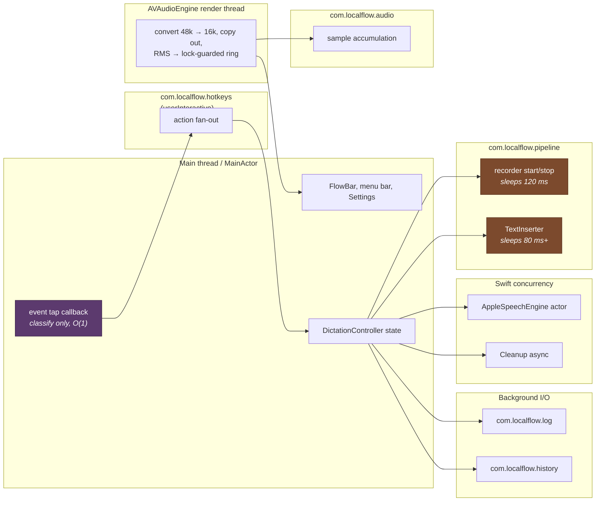

- The tap's run loop source is attached to the **main** run loop, so the callback
  runs on the main thread. It therefore does nothing but read a flag bit or a
  keycode and `async` the result onto `com.localflow.hotkeys`. If it ever did
  real work, macOS would disable the tap.
- `AudioRecorder.stop()` and `TextInserter.insert()` both **sleep**, which is why
  they live on `com.localflow.pipeline`. That queue is serial, so a fast
  press–release–press cannot interleave a start with a stop.
- The `AVAudioEngine` render thread copies samples out of the converter buffer
  before returning, because that buffer is reused the moment the callback ends.
- Logging and history are fire-and-forget on their own queues so disk I/O never
  appears in the dictation path.

---

## 8. Microphone lifecycle — the contradiction, and how it was resolved

The original brief asked for two incompatible things:

> "Keep `AVAudioEngine` running with the tap installed at all times."
> "Microphone is active **only** while the hotkey is held. Do not hold the mic
> open continuously."

Installing a tap on the input node is exactly what lights the orange indicator.
An always-live tap means the indicator is on 24/7 and stops meaning anything.

**Privacy won.** The latency it would have cost is bought back elsewhere:

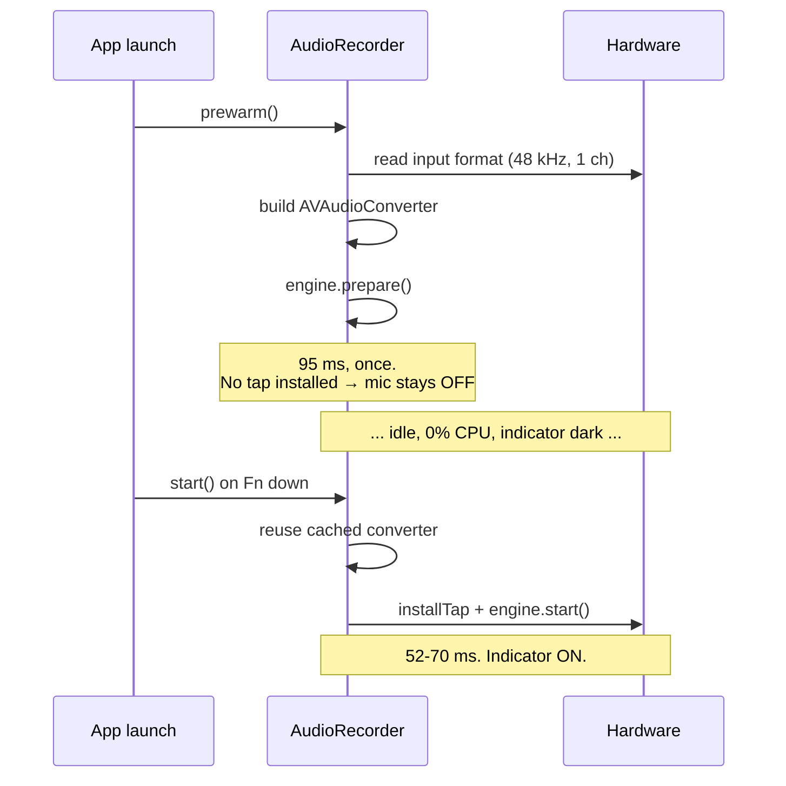

The tradeoff this accepts: **there is no 300 ms pre-roll ring buffer.** A pre-roll
inherently requires an always-live microphone. Instead, tap-to-lock guarantees a
too-short press is never silently discarded, which was the actual failure users
would hit.

---

## 9. Engine choice

`TranscriptionEngine` is a three-method protocol, so the backend is swappable.
Currently: **Apple `SpeechTranscriber` / `SpeechAnalyzer`** (macOS 26).

| Candidate | Resident memory | German | Verdict |
|---|---|---|---|
| **Apple SpeechTranscriber** | ~0 in-process (system-owned model) | first-class locale | **chosen** |
| Parakeet v3 / FluidAudio | ~600 MB | materially behind English | rejected — German, and eats the whole budget |
| whisper.cpp large-v3-turbo q5_0 | ~800 MB+ | excellent | held in reserve for technical vocabulary |

Deciding factors: German is a first-class locale rather than an afterthought, and
the model lives outside the app's address space, giving a **48.7 MB** idle
footprint against a 700 MB budget.

The known weakness is technical vocabulary — which is what the custom dictionary
and the optional cleanup pass exist for. If jargon accuracy becomes the binding
constraint, drop in whisper.cpp behind the same protocol; nothing outside
`AppleSpeechEngine.swift` changes.

### Bilingual handling

There is no mixed-language session. One locale is kept hot; if the first pass
comes back suspiciously short, the other locale is tried and the winner becomes
the new preferred locale. This avoids running two engines on every utterance.

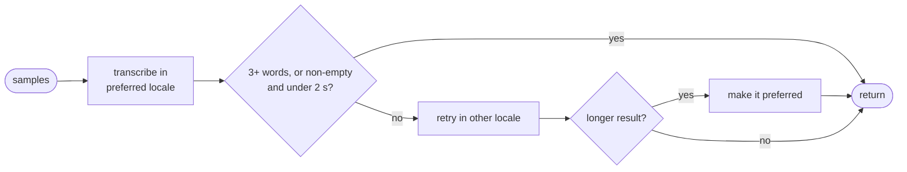

---

---

# Part II — NotesFM (meetings)

## 10. The shape of the second problem

Dictation is a two-second round trip. A meeting is a two-hour one, and that
changes every constraint.

| Part | Why it is hard on macOS |
|---|---|
| **Hearing the other side** | The far end never reaches your microphone — it comes out of the *output* device. Capturing it needs a Core Audio process tap, whose TCC permission **cannot be queried or requested by any API**. The only way to know you have it is to capture and look at the samples. |
| **Knowing who spoke** | Speaker diarisation is normally the hardest part of meeting transcription, and models that do it are large and slow. |
| **Running for hours** | Three hours of Float32 at 16 kHz is ≈690 MB. Nothing may be accumulated, ever. |
| **Not losing the meeting** | A crash, a flat battery or a hand edit two weeks later must not cost the transcript. |
| **Pausing** | Someone is about to say something off the record. A pause the orange microphone indicator contradicts is worse than no pause at all. |

Sections 11–14 are each a consequence of one of those.

---

## 11. Component map

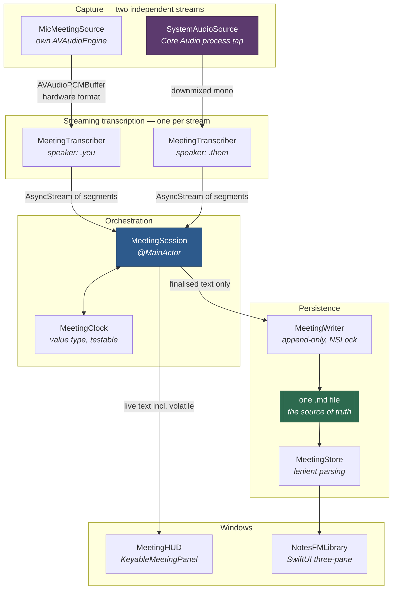

`SystemAudioSource` is purple for the same reason `HotkeyManager` is: it is where
the platform pain lives. It is the hardest file in the project.

Two details in that graph carry real weight:

- **Buffers are passed in the hardware's own format,** not as `[Float]` at an
  assumed rate. Apple's analyzer performs **no audio conversion of its own** and
  rejects anything that is not exactly the format it asked for — the documented
  cause of "works in batch, silent when streaming". Conversion therefore happens
  in one place that knows what that format is, `MeetingTranscriber.append`, and
  the converter is rebuilt whenever the incoming format changes.
- **Only finalised text reaches the writer.** Volatile results go to the HUD so
  the window is never frozen mid-sentence, but the file only ever receives words
  the engine has committed to.

### The two windows, and why the HUD needed a new panel class

| Window | Class | Can become key? |
|---|---|---|
| Flow bar (dictation) | `NonActivatingPanel` | **No** — it must never take the caret from the app being typed into |
| Meeting HUD | `KeyableMeetingPanel` | **Yes** — it contains a text field |

Reusing `NonActivatingPanel` for the HUD was a silent, total failure: a window
that can never become key has no first responder, so the "Add a note…" field
**swallowed every keystroke with no error**. The two properties answer different
questions, and the SDK is explicit about it — `NSWindowStyleMaskNonactivatingPanel`
"specifies that a panel that does not activate the owning application", while
keyboard focus is decided by `canBecomeKeyWindow`. Both together are what a
Spotlight-style panel needs: type a note without the call losing the foreground.

The field is **not** focused automatically. The user is in a call in another app,
and capturing their keystrokes the moment a window appears is worse than one
click.

---

## 12. Dual capture — where speaker labels come from

There is no diarisation model. Attribution is a property of **which stream the
words arrived on**:

> The microphone is *You*. The system output is *Them*.

That is the whole trick, and it is why two separate captures are worth the extra
work: the hardest part of meeting transcription becomes free.

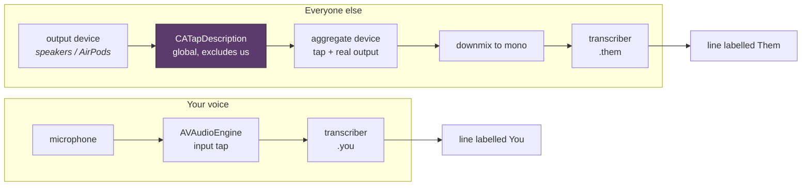

### Why a Core Audio tap and not ScreenCaptureKit

Different TCC service. The tap uses `kTCCServiceAudioCapture`, whose prompt says
*"would like access to record your system audio"*. ScreenCaptureKit would ask to
*"capture the contents of the system display"* and re-prompts monthly. Asking a
dictation app's users for screen recording is not a reasonable trade when an
audio-only permission exists.

### Four ways this goes silent, all handled

| Cause | Symptom | Handling |
|---|---|---|
| `isExclusive` set to `false` | total silence | **Never touched.** The global initialiser sets it `true`, meaning "everything *except* the listed processes". Setting it `false` inverts the meaning to "only the listed processes". |
| Tap without the real output device in the aggregate | delivers nothing | The aggregate contains both, with drift compensation. |
| Default **output** device changes | tap goes stale and silent | `kAudioHardwarePropertyDefaultOutputDevice` listener tears down and rebuilds the whole graph — on the control queue, never from inside the notification callback. |
| Default **input** device changes | mic half dies silently | `AVAudioEngineConfigurationChange` on the engine. Apple documents that the engine **stops itself** and nodes keep their old formats, so the tap is removed, the format re-read and the tap reinstalled. Dispatched off the notification queue, which the same docs warn can deadlock on synchronous teardown. |

The tap format is **read from the tap**, never hardcoded: it follows the output
device, and 24 kHz has been observed in the wild.

`MicMeetingSource` also honours `Settings.microphoneUID`, the same setting
dictation uses. Not doing so was a real bug — someone who picks a headset for
dictation reasonably expects the meeting to use it, and instead silently got the
system default.

### One microphone, two features

The interlock runs **both** ways, which it originally did not:

- A meeting refuses to start while a dictation is in progress. Dictation is the
  shorter-lived of the two, so the meeting waits rather than stealing the mic
  out from under a sentence.
- Dictation is refused while a meeting is active. Holding Fn mid-meeting used to
  open a second engine on the same device and type your own words into whatever
  app was in front, while the meeting recorded them again as *You*.

---

## 13. The meeting clock, and pause

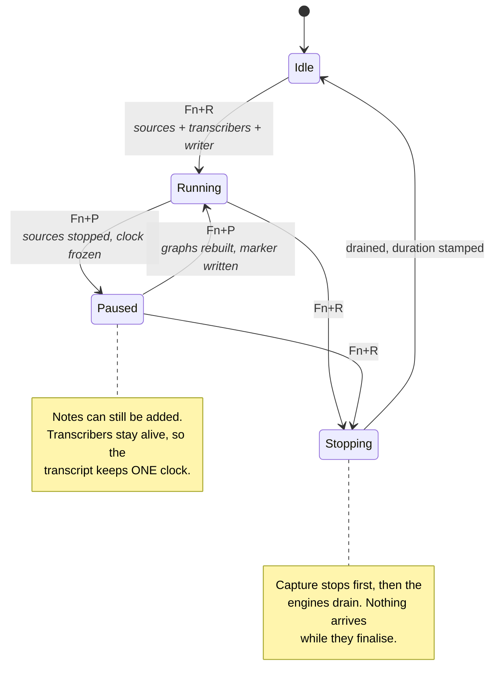

### Pause stops capture; it does not gate buffers

The cheap implementation is to keep both sources running and drop their buffers.
It was rejected. Installing a tap is exactly what lights the orange indicator, so
gating would leave the indicator on through a pause — and the moment somebody
pauses a meeting is precisely the moment they are about to say something they do
not want recorded. A pause the indicator contradicts is not one worth trusting.

So `pause()` stops both sources outright, and `resume()` rebuilds both graphs from
scratch. Rebuilding is not laziness about saving state: the output device may have
changed while the meeting was paused, and a fresh tap and a fresh engine both pick
up the current hardware format, which the transcribers then convert from.

If the microphone fails to restart, the session **stays paused** and says so. A
running clock over a dead microphone is the one failure this feature must never
present.

### Why the clock is recorded time, not wall clock

`AnalyzerInput` is enqueued **without** an explicit `bufferStartTime`, so Apple's
analyzer times every result by how much audio it has been handed. Hand it nothing
during a pause and its clock stops.

`MeetingClock` mirrors that exactly — wall time minus every paused span. Get it
wrong and a note added after a ten-minute pause is filed ten minutes below the
words it was written about. The frontmatter `duration` uses the same figure, so a
meeting paused for twenty minutes does not claim to have recorded them.

It is a **value type taking `Date` as a parameter**, not three fields on
`MeetingSession`, for one reason: `MeetingSession` needs TCC permission and real
hardware, so it cannot be tested, while this needs a date. It is the only part of
pause handling that is provable without a microphone, and every timestamp in the
file depends on it. The self-test advances it through two pauses, a stop-while-
paused, and an unstarted clock.

### Ordering: the marker is written on resume

The pause marker states how long the gap was, which is only known on resume. It
also has to land *after* any finalised text still arriving when the pause hit —
segments cross to the main actor through an `AsyncStream`, so writing the marker
at pause time could print it above the last words spoken. Writing it on resume
makes the ordering deterministic without fragile draining.

The cost, stated plainly: a crash *while paused* loses the gap annotation. The
transcript itself is intact, because it was already flushed.

---

## 14. Durability — the file is the original, not an export

The design rule everything else follows from: **the markdown file on disk is the
source of truth.** `MeetingNote` is metadata plus a body *string*, never a parsed
segment tree.

The reason is robustness. With a parsed model, editing the raw markdown could put
the file into a state the parser rejects, and the words would be lost on the next
save. With text as the truth, an edit can never corrupt anything — at worst a line
stops being recognised as a speaker line and renders as ordinary prose.

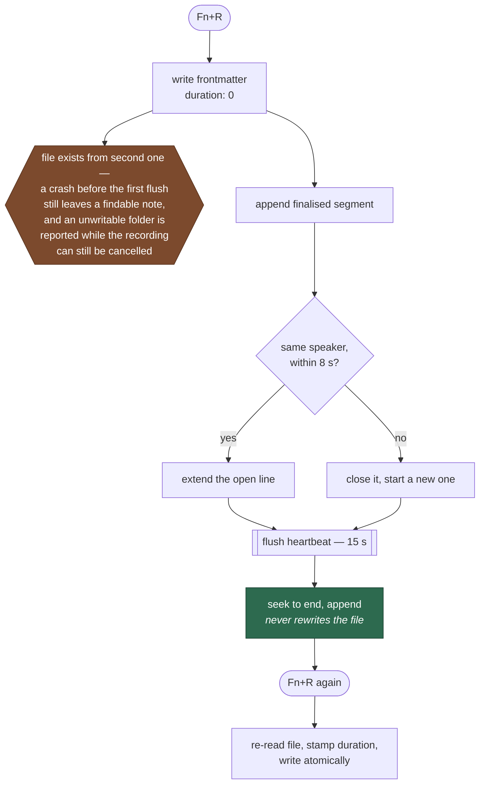

Five choices worth keeping:

- **Appends, never rewrites.** A flush in the third hour costs the same as one in
  the first minute.
- **15 seconds is the worst case a crash can cost.** Merging gives way to this,
  not the other way round: the open line is closed and written at every flush
  boundary, so a sentence spanning one becomes two lines. Holding words in memory
  that a force quit would erase is the worse trade.
- **`NSLock`, not an actor.** `append` is called from transcription callbacks and
  `flush` from a timer — synchronous contexts that cannot `await`. The lock is
  held only around array mutation, never around file I/O, so an audio callback
  never waits on the disk.
- **The handle is opened per flush.** `finish` replaces the file atomically to
  stamp the duration, and a long-lived handle would afterwards be writing into the
  file that was replaced.
- **`stamp` re-reads before writing,** so anything that touched the file during
  the meeting — including you editing it in another app — survives.

Failed disk writes are deliberately swallowed to the log. A write error must not
tear down the audio pipeline mid-meeting.

### Reading it back

`MeetingStore` never fails. Anything it cannot understand becomes body text,
because the alternative — refusing to open a file somebody typed into — loses
words. A file with no frontmatter at all still loads, recovering its title from
the first heading. The self-test asserts that a hand edit round-trips
**byte-identically**.

---

# Part III — Shared

## 15. Permissions and signing

### What must be granted by hand

| Permission | Granted via | Needed for |
|---|---|---|
| Microphone | `Info.plist` string + system prompt | recording |
| **Accessibility** | System Settings only — **no plist entry exists** | typing into other apps |
| **Input Monitoring** | System Settings only — **no plist entry exists** | seeing the hotkey |
| **System Audio Recording** | System Settings only — **cannot be queried or requested by any API** | the *Them* half of a meeting |

`kTCCServiceAudioCapture` is the odd one out: there is no API to check it and none
to prompt for it, so it cannot be pre-flighted. The only way to know is to capture
and inspect the samples, which is what `SystemAudioSource.hasHeardAudio` and the
**Test Audio Capture…** menu item exist for. macOS also requires a **relaunch**
after the grant.

> **TCC attributes permissions to the responsible process.** A binary launched
> from a shell has the *terminal* as responsible, so it is denied the microphone
> and silenced on the tap no matter what LocalFlow holds. Audio capture can only
> be tested **in-app** — which is why `--notesfm-selftest` covers the file
> pipeline and not capture.

Apple hard-blocks self-granting the last two by design — they are exactly what a
keylogger would want. `AppDelegate.requestPermissions()` calls
`AXIsProcessTrustedWithOptions` and `CGRequestListenEventAccess` so the app
*appears in the lists with a ready switch*, rather than making you hunt for it
with the `+` button.

### Why signing matters more than it looks

An ad-hoc signature's designated requirement is the binary's **cdhash**, which
changes on every rebuild. macOS therefore treats each rebuild as a different app
and **revokes Accessibility and Input Monitoring every time**.

`./make-cert.sh` creates a self-signed certificate in the login keychain and
trusts it for code signing (user trust only — no admin password). The designated
requirement becomes:

```
identifier "com.localflow.app" and certificate leaf = H"058c484f..."
```

Stable across rebuilds, so grants persist. `build.sh` picks the identity up
automatically and falls back to ad-hoc if it is absent.

> **Gotcha to remember:** if permissions *look* granted but nothing works, the
> TCC entry is stale from an older signature. Duplicate entries look identical in
> the UI. Fix: `tccutil reset Accessibility com.localflow.app` and
> `tccutil reset ListenEvent com.localflow.app`, then relaunch and re-grant.
> This exact problem cost real debugging time during the build.

---

## 16. File map

| File | Responsibility |
|---|---|
| `main.swift` | `AppDelegate`: menu bar, permission requests and warnings, trigger auto-selection |
| `DictationController.swift` | the state machine; the only file that knows the whole flow |
| `HotkeyManager.swift` | the single `CGEventTap`; event classification and consumption |
| `AudioRecorder.swift` | `AVAudioEngine` → 16 kHz mono Float32, prewarming, RMS level history |
| `AudioDevices.swift` | CoreAudio enumeration, UID → `AudioDeviceID` |
| `TranscriptionEngine.swift` | the swap point — 3 methods |
| `AppleSpeechEngine.swift` | `SpeechAnalyzer` backend, bilingual retry |
| `TextInserter.swift` | AX insertion, pasteboard + Cmd+V fallback, clipboard restore |
| `Cleanup.swift` | Ollama client, timeout, plausibility gate, fallback |
| `FlowBar.swift` | non-activating transparent `NSPanel`, theme-adaptive scrolling waveform |
| `SetupWindow.swift` | first-run permission guide, plain AppKit, live-polled status |
| `SettingsWindow.swift` | SwiftUI settings — Hotkeys, Speech, Meetings, Cleanup, General; launch-at-login |
| `Settings.swift` | `UserDefaults` wrapper, defaults, custom dictionary parsing |
| `History.swift` | JSONL transcript log in Application Support |
| `KeyboardWatch.swift` | IOKit HID scan, Fn-usage-type detection |
| `Sound.swift`, `Log.swift`, `WavWriter.swift`, `PendingInput.swift` | small helpers |

### `Sources/LocalFlow/NotesFM/`

| File | Responsibility |
|---|---|
| `Contracts.swift` | **read this first** — `MeetingNote`, `Speaker`, `TranscribedSegment`, the two capture/transcribe protocols, and `MeetingClock` |
| `MeetingSession.swift` | `@MainActor` orchestrator: sources + transcribers + writer, start/pause/resume/stop |
| `MeetingTranscriber.swift` | long-lived streaming `SpeechAnalyzer`, one per stream; the only place audio is converted |
| `MicMeetingSource.swift` | microphone, its own `AVAudioEngine`, honours the chosen device, rebuilds on a device change |
| `SystemAudioSource.swift` | Core Audio process tap — the hardest file here |
| `MeetingWriter.swift` | append-only markdown, flushes every 15 s, stamps duration at the end |
| `MeetingStore.swift` | markdown + frontmatter, lenient parsing, folder scan, rename/move/delete/search |
| `MeetingHUD.swift` | `KeyableMeetingPanel` — the floating window shown while recording |
| `NotesFMWindow.swift` / `NotesFMLibrary.swift` | `NSWindow` host and the SwiftUI three-pane library |
| `SelfTest.swift` | `--notesfm-selftest`, 43 checks, no microphone required |
| `CaptureTest.swift` | **Test Audio Capture…**, the only way to check the system-audio grant |

---

## 17. Measured results

Taken from a real session on macOS 26.5.2, Apple Silicon, 32 GB.

| Metric | Measured | Budget |
|---|---|---|
| App bundle on disk | **1.8 MB** (1792 KB binary) | ~600 MB with a bundled model ✅ |
| Idle RSS | **49 MB** (71.5 MB after Settings opens once — SwiftUI) | < 700 MB ✅ |
| Idle CPU | **0.0%** sustained | ≈0% ✅ |
| CPU, whole 2.5 min session incl. 2 dictations | 0.82 s total | — |
| ASR warm-load at launch | **85 ms** | vs 8–10 s cold start ✅ |
| Transcription, 5.06 s audio | **185 ms** (≈27× realtime) | — |
| Release → text on screen | **290 ms** | < 1 s ✅ |
| Mic open latency | **52–70 ms** | — |
| `--notesfm-selftest` | **43 / 43** | durability, round trip, note stamping, pause clock ✅ |
| Build warnings | **0** | Swift 6 strict concurrency on ✅ |

An earlier revision of this document and the README claimed a **740 KB** app.
That was already stale before meetings were added — the pre-pause binary measures
1656 KB. The argument it supported is unaffected; the number was simply wrong.

## 18. Not yet verified

Honest status, so nobody assumes more than was tested. Compiling is not evidence.

**Dictation (Part I)**

- Insertion tested in **TextEdit only**. Safari, Cursor/VS Code, Slack,
  Terminal/iTerm, Notes and Mail compose are **untested** — these are exactly
  where the pasteboard fallback and the paste delay get exercised.
- **German has not been spoken through it yet.** The locale retry path has never
  fired in practice.
- Peak CPU *during* transcription is not sampled — only the session average.
- Ollama cleanup is unexercised end-to-end; Ollama is not installed here.

**Meetings (Part II)**

- **Any real system-audio capture.** `kTCCServiceAudioCapture` has never been
  granted on the development machine, so the *Them* half of every diagram in
  Part II is reasoned from documentation, not observed.
- **A real meeting, of any length.** The multi-hour question is answered by docs
  only.
- **Pause and resume against live audio.** `MeetingClock` is unit-tested;
  stopping and rebuilding a real microphone graph and a real process tap
  mid-meeting is not.
- **A long pause with the analyzer left idle.** Nothing documents what
  `SpeechAnalyzer` does when its input goes quiet for an hour.
- **Typing into the HUD note field.** The panel fix follows from the SDK, but no
  keystroke has been observed landing in it.
- **The microphone surviving an input-device change mid-meeting**, and meetings
  honouring the chosen device.
- `Fn+P`, and `Fn+R` now that it no longer trips the dictation guard.
- The library sidebar and toolbar rendering.

**Verified since the last revision**

- The installer from a clean clone: checks → certificate → build → sign →
  `/Applications` → launch, then `--notesfm-selftest` from the installed binary.
  Accessibility and Input Monitoring survived being rebuilt from a **different
  directory**, which is the claim the `make-cert.sh` decision rests on and had
  not previously been demonstrated.

**Known open risks**

- Core Audio taps are reported to return silence for Microsoft Teams.
- On speakers rather than headphones the microphone re-hears the far end, so the
  same words may appear under both labels.
