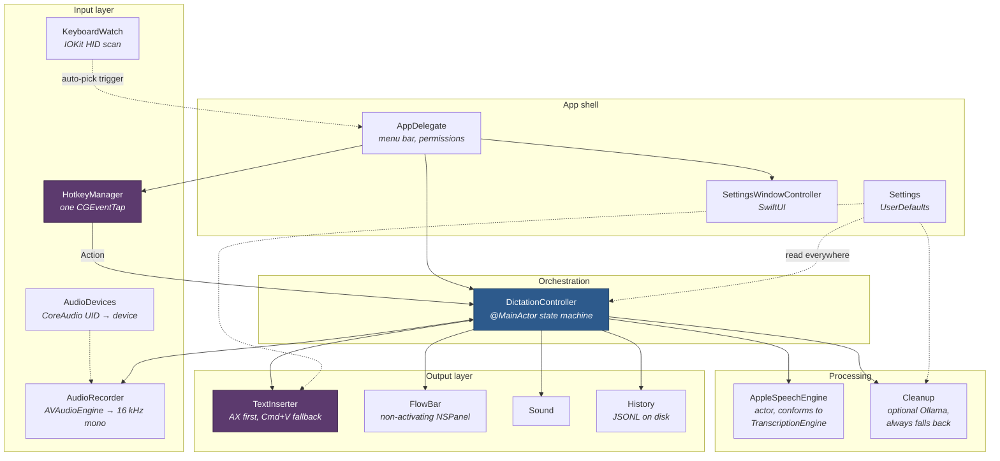
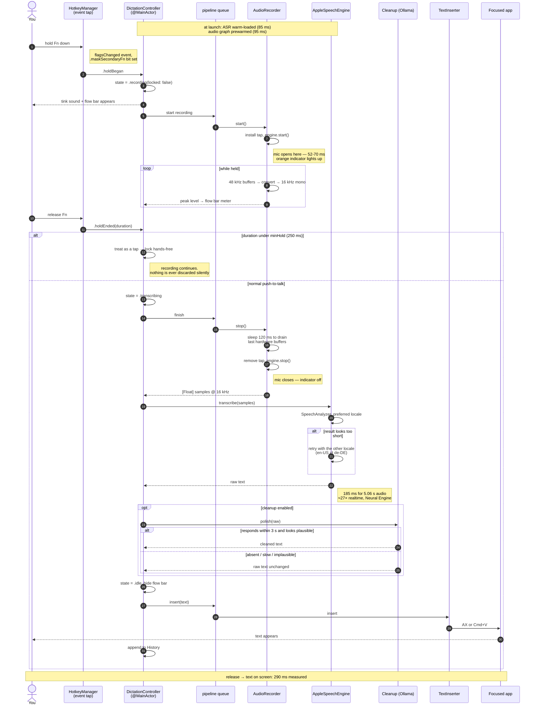
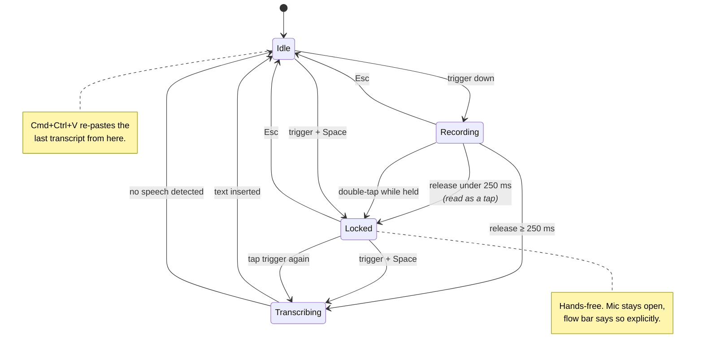
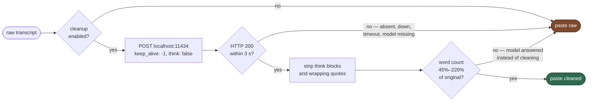
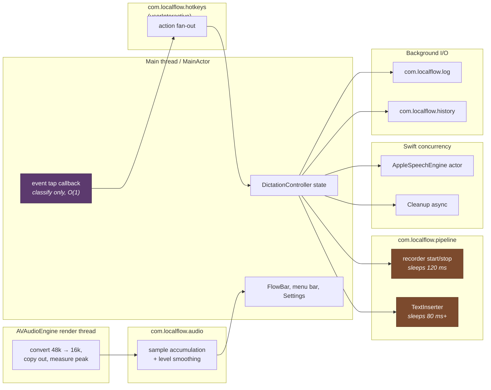
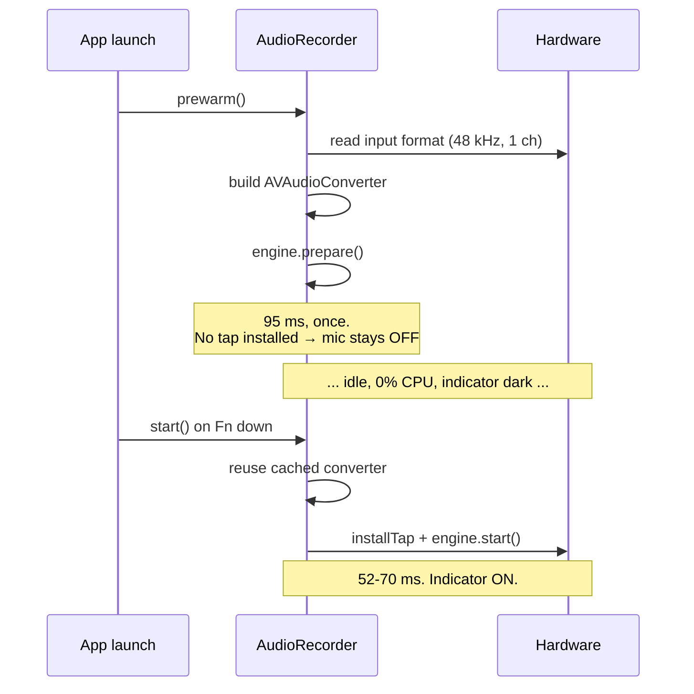

# LocalFlow — Architecture

Offline dictation for macOS. Hold a key, speak, release, text appears in
whatever app has focus. No account, no subscription, no network traffic except
optionally to `localhost:11434`.

This document explains **how the thing is built and why it is built that way**.
For decisions, dead ends and maintenance gotchas, see [`../NOTES.md`](../NOTES.md).

---

## 1. The shape of the problem

Dictation looks simple and is not. Four independent hard parts have to line up:

| Part | Why it is hard on macOS |
|---|---|
| **Hearing the hotkey** | Fn is not a key. It never emits `keyDown` — only a `flagsChanged` modifier event. Reading global keys at all needs a `CGEventTap`, which macOS silently disables if your callback is slow. |
| **Getting audio fast** | Starting `AVAudioEngine` per keypress costs time and clips the first syllable. Keeping it running forever holds the microphone open and makes the orange privacy indicator meaningless. |
| **Transcribing locally** | Must be fast enough to feel instant, accurate in two languages, and small enough not to eat a gigabyte of RAM. |
| **Typing into another app** | There is no supported "insert text into the frontmost app" API. Every available route is a workaround with different failure modes per app. |

Everything below is a consequence of one of those four.

---

## 2. Component map



The two purple boxes are where all the platform pain lives. `DictationController`
in the middle knows nothing about `CGEventTap` or `AXUIElement` — it just receives
semantic actions and produces text.

---

## 3. The main flow — hold, speak, release, text

**This is the diagram that matters.** Real measured timings from the log are
annotated on the right.



### Latency budget

| Stage | Cost | Notes |
|---|---|---|
| Fn down → mic capturing | **52–70 ms** | was 144 ms before prewarming |
| Fn up → buffers drained | 120 ms | fixed sleep, off the main thread |
| Transcription | **185–197 ms** | for 5–7 s utterances |
| Paste delay | 80 ms | configurable; Electron/terminals need it |
| **Release → text visible** | **≈290 ms** | target was under 1 s |

---

## 4. Hotkey state machine

The earlier build had a real bug here: a press shorter than the audio engine's
start time captured `0.00 s` and did nothing, silently, with no feedback. The
fix is that **every press now does something**.



`minHold` (250 ms default) is the dividing line between "hold" and "tap", and is
adjustable in Settings → Hotkeys.

### What the event tap consumes, and what it does not

Swallowing the wrong event breaks the keyboard system-wide, so the tap is
deliberately conservative:

| Event | Consumed? | Why |
|---|---|---|
| Fn / Ctrl+Opt `flagsChanged` | **No** | Fn is a real modifier for the F-key row and countless shortcuts. |
| `Space` while trigger held | Yes | Otherwise a space character leaks into your document. |
| `Esc` | Only while recording | Esc must keep working normally everywhere else. |
| `Cmd+Ctrl+V` | Yes | It is our shortcut. |
| Everything else | **No** | Passed straight through. |

### Two tap survival rules

1. **Re-enable after the system kills it.** macOS disables a tap whose callback
   blocks too long, delivering `.tapDisabledByTimeout` or
   `.tapDisabledByUserInput`. `HotkeyManager.handle` catches both and calls
   `CGEvent.tapEnable` again. Without this the app dies silently after a hiccup.
2. **Ignore your own keystrokes.** `TextInserter` synthesizes Cmd+V, and the tap
   would see it. Every synthesized event carries a marker in its
   `.eventSourceUserData` field, and the tap drops anything bearing it. Without
   this, pasting could re-trigger the app.

---

## 5. Text insertion — the messy part

There is no clean API. Two routes, tried in order:

```mermaid
flowchart TD
    START([transcript ready]) --> AXOK{Accessibility<br/>permission granted?}
    AXOK -->|no| PB
    AXOK -->|yes| FOCUS[get system-wide<br/>focused UI element]
    FOCUS --> SETTABLE{is kAXSelectedText<br/><b>settable?</b>}
    SETTABLE -->|no| PB
    SETTABLE -->|yes| WRITE[set kAXSelectedTextAttribute]
    WRITE --> OK{success?}
    OK -->|yes| DONE([text inserted<br/>clipboard untouched])
    OK -->|no| PB

    PB[save entire pasteboard<br/>every type of every item] --> SETPB[write transcript]
    SETPB --> WAIT[wait pasteDelay<br/>default 80 ms]
    WAIT --> MODS[poll until physical modifiers<br/>released, max 500 ms]
    MODS --> POST[post Cmd+V<br/>tagged as synthetic]
    POST --> REST[restore original pasteboard<br/>after max&#40;350 ms, 3× delay&#41;]
    REST --> DONE

    style DONE fill:#2d6a4f,stroke:#1b4332,color:#fff
    style PB fill:#7c4a2d,stroke:#5a3520,color:#fff
```



Three non-obvious details, each one a bug that was designed out:

- **`AXUIElementIsAttributeSettable` is checked before writing.** Some apps
  return `.success` for a write that does nothing. Trusting the return code
  alone would silently swallow your words.
- **Physical modifiers are waited on.** A synthesized Cmd+V merges with anything
  you are still physically holding. If Fn or Ctrl+Opt is still down, Cmd+V
  becomes a completely different shortcut.
- **The paste delay exists because of Electron.** Slack, VS Code, Cursor and
  terminals read the pasteboard asynchronously and drop the paste if the
  keystroke arrives before they notice the new pasteboard generation.

Your clipboard is snapshotted per-type per-item and restored afterwards, so
dictating never costs you what you had copied.

---

## 6. Cleanup pass — designed to be skippable

The rule is **never let the polish step eat your words.** Every failure path
returns the raw transcript.



The plausibility gate is there because small models routinely ignore the system
prompt and *answer* the transcript rather than clean it. If you dictate "how's
your day going" a 4B model may happily reply "I'm doing well, thanks!". A word
count outside that band is treated as a failure.

`keep_alive: -1` pins the model in memory so it does not reload per dictation.
`think: false` is sent because qwen3 is a reasoning model, and `<think>` blocks
are stripped defensively regardless since some Ollama builds leak them anyway.

**Currently shipped off by default** — Ollama is not installed on this machine,
and raw Apple transcription already punctuates and capitalizes correctly.

---

## 7. Threading model

This is the part most likely to bite a future maintainer. Two rules govern
everything: **never block the event tap**, and **never sleep on the main thread**.



- The tap's run loop source is attached to the **main** run loop, so the callback
  runs on the main thread. It therefore does nothing but read a flag bit or a
  keycode and `async` the result onto `com.localflow.hotkeys`. If it ever did
  real work, macOS would disable the tap.
- `AudioRecorder.stop()` and `TextInserter.insert()` both **sleep**, which is why
  they live on `com.localflow.pipeline`. That queue is serial, so a fast
  press–release–press cannot interleave a start with a stop.
- The `AVAudioEngine` render thread copies samples out of the converter buffer
  before returning, because that buffer is reused the moment the callback ends.
- Logging and history are fire-and-forget on their own queues so disk I/O never
  appears in the dictation path.

---

## 8. Microphone lifecycle — the contradiction, and how it was resolved

The original brief asked for two incompatible things:

> "Keep `AVAudioEngine` running with the tap installed at all times."
> "Microphone is active **only** while the hotkey is held. Do not hold the mic
> open continuously."

Installing a tap on the input node is exactly what lights the orange indicator.
An always-live tap means the indicator is on 24/7 and stops meaning anything.

**Privacy won.** The latency it would have cost is bought back elsewhere:



The tradeoff this accepts: **there is no 300 ms pre-roll ring buffer.** A pre-roll
inherently requires an always-live microphone. Instead, tap-to-lock guarantees a
too-short press is never silently discarded, which was the actual failure users
would hit.

---

## 9. Engine choice

`TranscriptionEngine` is a three-method protocol, so the backend is swappable.
Currently: **Apple `SpeechTranscriber` / `SpeechAnalyzer`** (macOS 26).

| Candidate | Resident memory | German | Verdict |
|---|---|---|---|
| **Apple SpeechTranscriber** | ~0 in-process (system-owned model) | first-class locale | **chosen** |
| Parakeet v3 / FluidAudio | ~600 MB | materially behind English | rejected — German, and eats the whole budget |
| whisper.cpp large-v3-turbo q5_0 | ~800 MB+ | excellent | held in reserve for technical vocabulary |

Deciding factors: German is a first-class locale rather than an afterthought, and
the model lives outside the app's address space, giving a **48.7 MB** idle
footprint against a 700 MB budget.

The known weakness is technical vocabulary — which is what the custom dictionary
and the optional cleanup pass exist for. If jargon accuracy becomes the binding
constraint, drop in whisper.cpp behind the same protocol; nothing outside
`AppleSpeechEngine.swift` changes.

### Bilingual handling

There is no mixed-language session. One locale is kept hot; if the first pass
comes back suspiciously short, the other locale is tried and the winner becomes
the new preferred locale. This avoids running two engines on every utterance.


---

## 10. Permissions and signing

### What must be granted by hand

| Permission | Granted via | Needed for |
|---|---|---|
| Microphone | `Info.plist` string + system prompt | recording |
| **Accessibility** | System Settings only — **no plist entry exists** | typing into other apps |
| **Input Monitoring** | System Settings only — **no plist entry exists** | seeing the hotkey |

Apple hard-blocks self-granting the last two by design — they are exactly what a
keylogger would want. `AppDelegate.requestPermissions()` calls
`AXIsProcessTrustedWithOptions` and `CGRequestListenEventAccess` so the app
*appears in the lists with a ready switch*, rather than making you hunt for it
with the `+` button.

### Why signing matters more than it looks

An ad-hoc signature's designated requirement is the binary's **cdhash**, which
changes on every rebuild. macOS therefore treats each rebuild as a different app
and **revokes Accessibility and Input Monitoring every time**.

`./make-cert.sh` creates a self-signed certificate in the login keychain and
trusts it for code signing (user trust only — no admin password). The designated
requirement becomes:

```
identifier "com.localflow.app" and certificate leaf = H"058c484f..."
```

Stable across rebuilds, so grants persist. `build.sh` picks the identity up
automatically and falls back to ad-hoc if it is absent.

> **Gotcha to remember:** if permissions *look* granted but nothing works, the
> TCC entry is stale from an older signature. Duplicate entries look identical in
> the UI. Fix: `tccutil reset Accessibility com.localflow.app` and
> `tccutil reset ListenEvent com.localflow.app`, then relaunch and re-grant.
> This exact problem cost real debugging time during the build.

---

## 11. File map

| File | Responsibility |
|---|---|
| `main.swift` | `AppDelegate`: menu bar, permission requests and warnings, trigger auto-selection |
| `DictationController.swift` | the state machine; the only file that knows the whole flow |
| `HotkeyManager.swift` | the single `CGEventTap`; event classification and consumption |
| `AudioRecorder.swift` | `AVAudioEngine` → 16 kHz mono Float32, prewarming, level metering |
| `AudioDevices.swift` | CoreAudio enumeration, UID → `AudioDeviceID` |
| `TranscriptionEngine.swift` | the swap point — 3 methods |
| `AppleSpeechEngine.swift` | `SpeechAnalyzer` backend, bilingual retry |
| `TextInserter.swift` | AX insertion, pasteboard + Cmd+V fallback, clipboard restore |
| `Cleanup.swift` | Ollama client, timeout, plausibility gate, fallback |
| `FlowBar.swift` | non-activating `NSPanel`, level meter |
| `SettingsWindowController.swift` | SwiftUI settings, launch-at-login |
| `Settings.swift` | `UserDefaults` wrapper, defaults, custom dictionary parsing |
| `History.swift` | JSONL transcript log in Application Support |
| `KeyboardWatch.swift` | IOKit HID scan, Fn-usage-type detection |
| `Sound.swift`, `Log.swift`, `WavWriter.swift`, `PendingInput.swift` | small helpers |

---

## 12. Measured results

Taken from a real session on macOS 26.5.2, Apple Silicon, 32 GB.

| Metric | Measured | Budget |
|---|---|---|
| Idle RSS | **48.7 MB** (71.5 MB after Settings opens once — SwiftUI) | < 700 MB ✅ |
| Idle CPU | **0.0%** sustained | ≈0% ✅ |
| CPU, whole 2.5 min session incl. 2 dictations | 0.82 s total | — |
| ASR warm-load at launch | **85 ms** | vs 8–10 s cold start ✅ |
| Transcription, 5.06 s audio | **185 ms** (≈27× realtime) | — |
| Release → text on screen | **290 ms** | < 1 s ✅ |
| Mic open latency | **52–70 ms** | — |

## 13. Not yet verified

Honest status, so nobody assumes more than was tested:

- Insertion tested in **TextEdit only**. Safari, Cursor/VS Code, Slack,
  Terminal/iTerm, Notes and Mail compose are **untested** — these are exactly
  where the pasteboard fallback and the paste delay get exercised.
- **German has not been spoken through it yet.** The locale retry path has never
  fired in practice.
- Peak CPU *during* transcription is not sampled — only the session average.
- Ollama cleanup is unexercised end-to-end; Ollama is not installed here.
